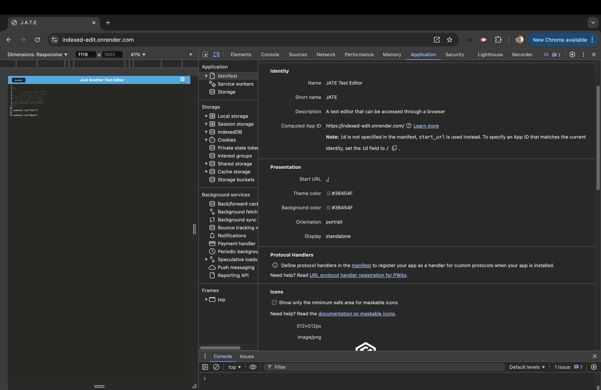

# Indexed Edit

[](https://github.com/Thecaprifire)
[](https://choosealicense.com/licenses/mit/)
  
  
## Description:
The indexed-edit application is a powerful single-page text editor built as a Progressive Web Application (PWA) designed to offer seamless functionality both online and offline. Utilizing IndexedDB as its primary storage mechanism, the app ensures that user data is persistently stored and efficiently retrieved, even in offline scenarios. By leveraging the idb package—a lightweight, effective wrapper around the IndexedDB API used by industry giants such as Google and Mozilla—indexed-edit integrates robust data persistence techniques, providing redundancy for optimal support across various browsers. This allows users to continue their editing tasks without disruption, meeting the key PWA criteria.


 ## Table of Contents
  * [Description](#description)
  * [The Challenge](#the-challenge)
  * [User Story](#user-story)
  * [Acceptance Criteria](#acceptance-criteria)
  * [Installation Process](#installation-process)
  * [Actual Website Link](#actual-website-link)
  * [Walkthrough Video](#walkthrough-video)
  * [Screenshots](#screenshots)
  * [Resources](#resources)
  * [Questions](#questions)
  * [License](#license)


## The Challenge:
Build a text editor that runs in the browser. The app will be a single-page application that meets the PWA criteria. Additionally, it will feature a number of data persistence techniques that serve as redundancy in case one of the options is not supported by the browser. The application will also function offline.


## User Story
```md
AS A developer
I WANT to create notes or code snippets with or without an internet connection
SO THAT I can reliably retrieve them for later use
```


## Acceptance Criteria
```md
GIVEN a text editor web application
WHEN I open my application in my editor
THEN I should see a client server folder structure
WHEN I run `npm run start` from the root directory
THEN I find that my application should start up the backend and serve the client
WHEN I run the text editor application from my terminal
THEN I find that my JavaScript files have been bundled using webpack
WHEN I run my webpack plugins
THEN I find that I have a generated HTML file, service worker, and a manifest file
WHEN I use next-gen JavaScript in my application
THEN I find that the text editor still functions in the browser without errors
WHEN I open the text editor
THEN I find that IndexedDB has immediately created a database storage
WHEN I enter content and subsequently click off of the DOM window
THEN I find that the content in the text editor has been saved with IndexedDB
WHEN I reopen the text editor after closing it
THEN I find that the content in the text editor has been retrieved from our IndexedDB
WHEN I click on the Install button
THEN I download my web application as an icon on my desktop
WHEN I load my web application
THEN I should have a registered service worker using workbox
WHEN I register a service worker
THEN I should have my static assets pre cached upon loading along with subsequent pages and static assets
WHEN I deploy to Render
THEN I should have proper build scripts for a webpack application
```


## Installation Process
To install and set up indexed-edit locally, follow these steps:

1. Clone the repository:
Begin by cloning the repository to your local machine using Git: `git clone https://github.com/Thecaprifire/indexed-edit`
2. Navigate to the project directory:
Once the repository is cloned, navigate into the project directory: `cd indexed-edit`
3. Install dependencies:
Install the required dependencies for both the client and server using npm. This includes setting up the necessary packages for the text editor, service worker, and IndexedDB functionality. `cd client`, then `npm install`, next `cd ../server`, then `npm install`, next `cd ..`, then `npm install`
4. Build the application:
Build the production-ready application by running the build script: `npm run build`
5. Start the development server:
To run the application in development mode, start the server using the following command: `npm run start:dev`
6. Open the app:
After starting the server, open your browser and navigate to: `http://localhost:3000`

You should now be able to use indexed-edit as a fully functional, offline-capable text editor.


## Actual Website Link:
[Indexed Edit](https://indexed-edit.onrender.com)


## Walkthrough Video
[Indexed Edit - Youtube Link](https://youtu.be/DFuoppFINUQ)


## Screenshots:
### Figure 1.
 
### Figure 2.
 
### Figure 3.
 
### Figure 4.
 


## Resources
- Dynamic JavaScript
- Express.js: [Version 4.17.1](https://www.npmjs.com/package/express)
- IndexedDB: [MDN Web Docs](https://developer.mozilla.org/en-US/docs/Web/API/IndexedDB_API)
- idb: [Version 7.0.1](https://www.npmjs.com/package/idb)
- Nodemon: [Version 2.0.4](https://www.npmjs.com/package/nodemon)
- Concurrently: [Version 5.2.0](https://www.npmjs.com/package/concurrently)
- Service Workers: [MDN Web Docs](https://developer.mozilla.org/en-US/docs/Web/API/Service_Worker_API)
  

## Questions
  Contact the author with any questions!<br>
  Github link: [Thecaprifire](https://github.com/Thecaprifire)<br>
  Email: ianjandaluz@gmail.com


## License
  This project is [MIT](https://choosealicense.com/licenses/mit/) licensed.<br />

  Copyright © 2024 [JAN IAN DALUZ](https://github.com/Thecaprifire)
  
  <hr>
  <p align='center'><i>
  Here’s to your coding journey! 🎉 JAN IAN DALUZ
  </i></p>